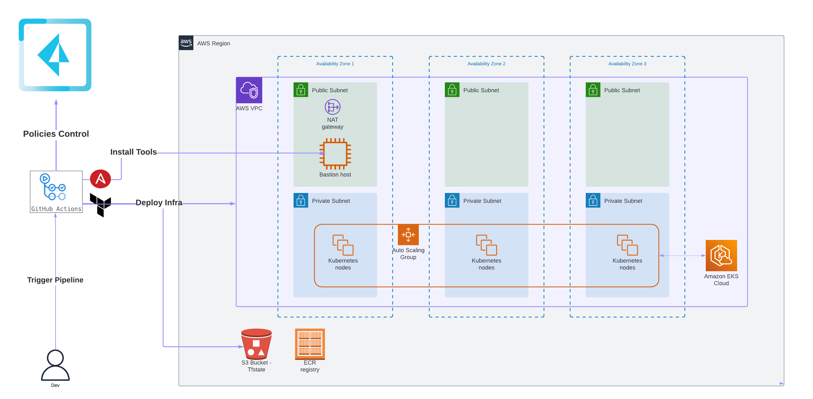

# Terraform Automate EKS deployment 

Deploy EKS with Terraform

[](https://github.com/cleypanw/terraform-aws-eks/actions/workflows/deploy_infrastructure.yml)


### Purpose

This repository provides a lab to show deployment of an EKS cluster and its associated infrastructure  (VPC, SG, S3, etc.) in an automated way with GitHub Action.

It is possible to use this code to quickly deploy a cloud native environment (K8s) for demonstration purposes.


### High Level Diagram




### Sequence Diagram


### Roll out Lab Deployment

#### Requirements

- **GitHub Account** to create private fork
- **AWS Subscription** with Programmatic Access (**AWS_ACCESS_KEY_ID / AWS_SECRET_ACCESS_KEY** )
- **SSH Key**


#### Create a fork of the repository

1. Login with your github account
2. Open https://github.com/cleypanw/terraform-aws-eks and click on Fork


#### Configure GitHub Action Secrets

Open **Settings > Security > Secrets and variables > Actions** 

- <u>**Secrets**</u>
  - **AWS_ACCESS_KEY_ID** 
  - **AWS_SECRET_ACCESS_KEY**
  - **SSH_PRIVATE_KEY** (Private key yes, will be used by ansible to connect to bastion instance to install tools)


### Deploy Infrastructure Workflow 

1) Open **Actions > All Workflows > Deploy Infrastructure** 


2) Click on `Run workflow` , and **set your configuration**

   

- AWS region in which to deploy the infrastructure (Mandatory) : **default = eu-west-3**

- Prefix name for resources to be created: s3 bucket, vpc, eks, ec2, etc : **default = eks** 

  *(all AWS resources created will be prefix, don't worry if you already have resources with this prefix, a random character string is also generated as a suffix,  under the hood in the code, so each deployment will have a unique name, even if the same prefix is used several time)*

- Number of worker nodes in eks_cluster : **default = 3** (choice between 1 to 5)

- Worker nodes type in eks_cluster : **default = t3.medium** 

- Public ssh key to connect to ec2-bastion host : **Your SSH PUBLIC KEY**

  

3. Click  `Run workflow`, and deployment will start

4. You can monitor the deployment of all stages 

   


*NB: click on the stage to have details* ie ansible stage below 


5. Retrieve the terraform outputs to connect to the instance by clicking on the`Deploy infra - Terraform Apply` job and scrolling to the bottom of this stage.


**🎉 Congratulations your AWS Environment is now deployed, and your EKS cluster is running  🎉**


#### Connect to your EKS and deploy application

The kubernetes APIs (kube-apiserver) are not publicly accessible, so you need to connect to the bastion servers via SSH (see terraform output above to retrieve the IP).

All tools are already deployed on the bastion instance by Ansible at boot time.

<u>EKS **public** API server endpoint is **disabled**</u>, only <u>EKS **private** API server endpoint is **enabled**</u> 

It is only possible to connect to the Kubernetes cluster APIs via the **ec2-bastion instance**.


1) Connect to ec2-bastion with your ssh private key and user **Ubuntu** and IP retrieve from TF output (ec2instance_ip)

   ```shell
   ssh -i <ssh_private_key> ubuntu@${TF_output_ec2instance_ip}
   ```

   

2. Configure your AWS account (example you can use aws configure cli command)


3. Retrieve the name of your cluster (either from the terraform output or via aws cli)

   ```shell
   aws eks list-clusters
   ```

   

   


4. Update Kubeconfig

   ```shell
   aws eks update-kubeconfig --name ${eks_cluster_name}
   ```

   *Example*:

   


5. You can now manage your cluster and deploy applications (with kubectl by example)

   

6. Optional - Test - deploy application

   ```shell
   kubectl run weather-alpine --image=chrisley75/weather-alpine:0.2 -l app=weather-alpine --expose --port=8080
   kubectl patch svc weather-alpine -p '{"spec": {"type": "LoadBalancer"}}'
   kubectl get all
   NAME                 READY   STATUS    RESTARTS   AGE
   pod/weather-alpine   1/1     Running   0          96s
   
   NAME                     TYPE           CLUSTER-IP     EXTERNAL-IP                                                               PORT(S)          AGE
   service/kubernetes       ClusterIP      172.20.0.1     <none>                                                                    443/TCP          6h18m
   service/weather-alpine   LoadBalancer   172.20.69.39   a9e504e4734c44212bd738f8dc3a302e-1865608803.eu-west-3.elb.amazonaws.com   8080:31471/TCP   96s
   ```

   


🎉 **Congratulations your EKS Cluster is fully functionnal.** 🎉


### Delete Infrastructure Workflow 

1. Open Actions > All Workflows > Delete Infrastructure 


2. Click on `Run workflow` , and **fill in the fields **


- AWS region in which the infrastructure to delete is deployed : **default = eu-west-3** (the region where is deployed your AWS infra)
- Prefix name for resources to be delete: s3 bucket, vpc, eks, ec2, etc. : **default = eks** (prefix set during build stage) 


3. Click  `Run workflow`, and delete will start

